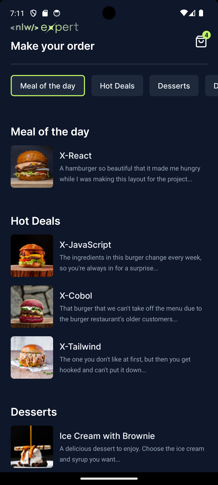
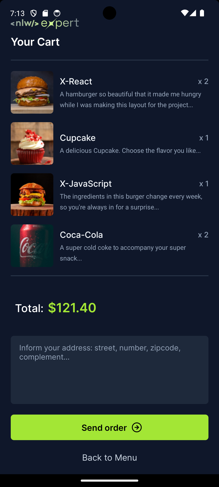
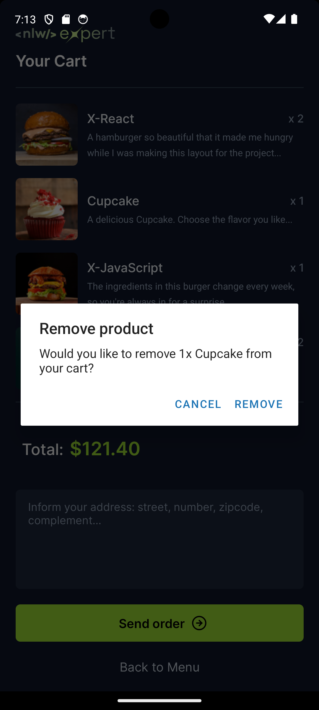
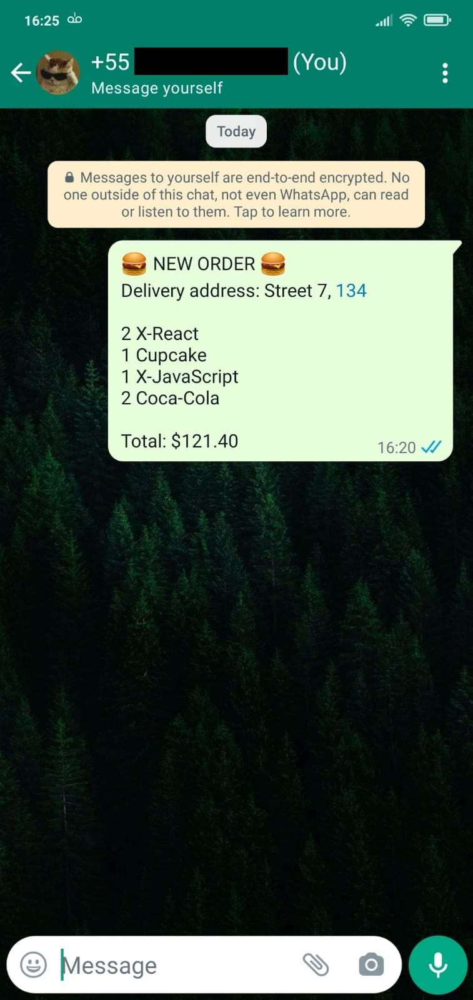

<h1 align="center">
  <div>
    
    <p>NLW Restaurant Delivery</p>
  </div>
  <div>
    
    
    
    
    
  </div>
</h1>

## ✨ Description

This app shows the menu of a restaurant and allow customers to make their order and send it through WhastApp.

Developed with 💜 during the Next Level Week - React Native by Rocketseat.

## 🚀 Technologies
-  React Native (JavaScript library to build mobile app interfaces)
-  TypeScript (programming language)
-  Expo (framework to create mobile apps)
-  Nativewind / TailwindCSS (CSS framework to style components)
-  Async Storage (to store data)
-  Google fonts - Inter (custom font)
-  Vector Icons - Feather (icons library)
-  Zustand (state management)
-  WhatsApp API (to send the orders to the restaurant)

## 💻 Installation

> Make sure you have Node.js installed on your machine.

1. Clone this repository <br />
```bash
git clone https://github.com/renatomarquesteles/nlw-expert-rn.git
```
2. Install the project dependencies <br />
```bash
npm install
```
3. Run the expo metro bundler <br />
```bash
npx expo start
```
4. Install the app "Expo Go" on your smartphone (available at Google Play Store and Apple Store)
5. Scan the QR Code that's showing in your terminal and wait for the installation on your smartphone

## 🌟 Preview

<div style="display:flex">
  
  
  
  
</div>
